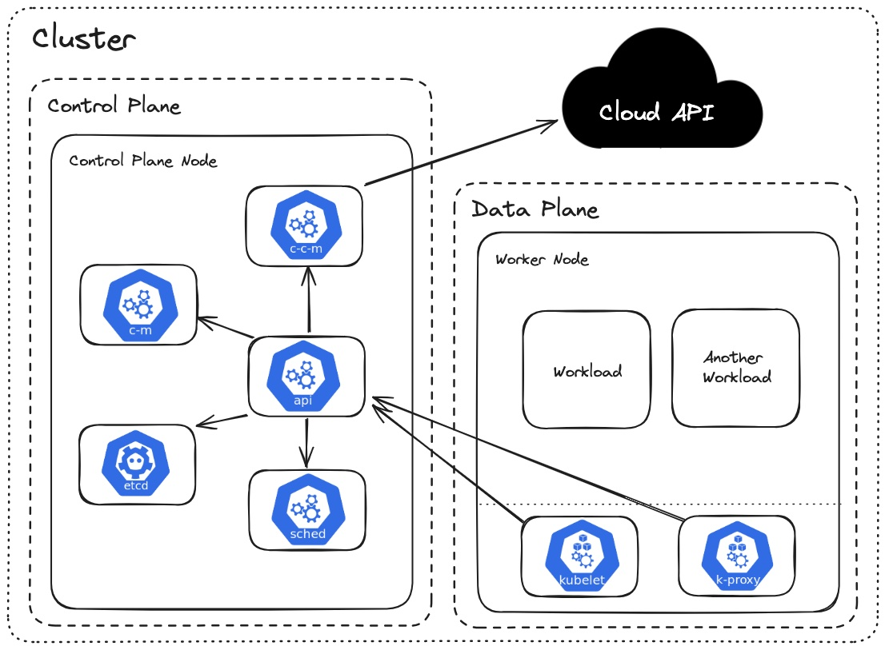

# Kubernetes 101

This repo provides a brief introduction to Kubernetes, from basic concepts and architecure to a functional deployment example. The information used for building this guide was taken from the offical [Kubernetes Documentation](https://kubernetes.io.docs), [Bogdan Stashchuk](https://www.youtube.com/watch?v=d6WC5n9G_sM) and from [DevOps Directive](https://www.youtube.com/watch?v=2T86xAtR6Fo&t=3095s) YouTube courses on Kubernetes.

To follow the full guide, the following dependencies should be installed:

- [Docker](https://docs.docker.com/manuals/)
- [kind](https://kind.sigs.k8s.io/)
- [kubectl](https://kubernetes.io/docs/tasks/tools/)

## Technology Overview
### Building Blocks

Kubernetes, also known as k8s, is an open source system for managing containerized applications across multiple hosts. It provides basic mechanisms for deployment, maintenance, and scaling of applications.

The first concepts to understand with regard to kubernetes are:

- **Pod**: Smallest deployable unit in Kubernetes. A pod is a group of one or more containers, which can share resources and be configured to work together in services.
- **Node**: A "node" is a computer/server, responsible for hosting pods. Multiple nodes are joined together to form a "cluster". A cluster can also contain a single node.
- **Control Plane**: A subset of nodes in the cluster dedicated to performing system tasks. Nodes that are part of the control plane are referred to as "control plane nodes".
- **Data Plane**: A subset of nodes in the cluster dedicated to running user worklods. Nodes that are part of the data plane are referred to as "worker nodes".

### Components and Architecture

Kubernetes is comprised of many smaller components:

- **etcd**: Key-value store used for storing all cluster data. It serves as the source of truth for the cluster state and configuration.
- **kube-api-server**: The front end for the Kubernetes control plane.
- **kube-scheduler**: Schedules pods onto the appropriate nodes based on resource availability and other constraints.
- **kube-controller-manager**: Runs controller processes. Each controller is a separate process that manages routine tasks such as maintaining the desired state of resources, managing replication, handling node operations, etc...
- **cloud-controller-manager**: Integrates with the underlying cloud provider (if running in one) to manage cloud-specific resources. It handles tasks such as managing load balancers, storage, and networking.
- **kubelet**: An agent that runs on each worker node and ensures that containers are running in pods and manages the lifecycle of containers.
- **kube-proxy**: This network proxy runs on each node and maintains network rules to allow communication to and from pods.
