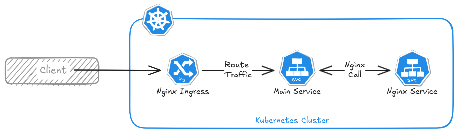

# K8S Introduction

Brief overview of Kubernetes, covering core concepts, architecture, and a hands-on deployment example. This introduction assumes minimal experience with `kubectl`, the Kubernetes CLI. For more detailed information, refer to the official [kubectl reference](https://kubernetes.io/docs/reference/kubectl/).

## Technology Overview
### Building Blocks

Kubernetes, also known as k8s, is an open source system for managing containerized applications across multiple hosts. It provides basic mechanisms for deployment, maintenance, and scaling of applications.

The first concepts to understand with regard to kubernetes are:

- **Pod**: Smallest deployable unit in Kubernetes. A pod is a group of one or more containers, which can share resources and be configured to work together in services.
- **Node**: A "node" is a computer/server, responsible for hosting pods. Multiple nodes are joined together to form a "cluster". A cluster can also contain a single node.
- **Control Plane**: A subset of nodes in the cluster dedicated to performing system tasks. Nodes that are part of the control plane are referred to as "control plane nodes".
- **Data Plane**: A subset of nodes in the cluster dedicated to running user worklods. Nodes that are part of the data plane are referred to as "worker nodes".

### Components and Architecture

Kubernetes is comprised of many smaller components:

- **etcd**: Key-value store used for storing all cluster data. It serves as the source of truth for the cluster state and configuration.
- **kube-api-server**: The front end for the Kubernetes control plane.
- **kube-scheduler**: Schedules pods onto the appropriate nodes based on resource availability and other constraints.
- **kube-controller-manager**: Runs controller processes. Each controller is a separate process that manages routine tasks such as maintaining the desired state of resources, managing replication, handling node operations, etc...
- **cloud-controller-manager**: Integrates with the underlying cloud provider (if running in one) to manage cloud-specific resources. It handles tasks such as managing load balancers, storage, and networking.
- **kubelet**: An agent that runs on each worker node and ensures that containers are running in pods and manages the lifecycle of containers.
- **kube-proxy**: This network proxy runs on each node and maintains network rules to allow communication to and from pods.

### kubectl

`kubectl` is the command-line tool for interacting with the Kubernetes API. Here are some basic concepts to get started:

- **Deployments**: a deployment provides declarative updates to applications. It manages the creation and scaling of Pods.
- **Services**: a service is an abstraction that defines a logical set of Pods and a policy by which to access them. Services enable communication between different parts of your application.
- **Ingress**: an ingress is an API object that manages external access to services within a cluster, typically HTTP. Ingress can provide load balancing, SSL termination, and name-based virtual hosting.
- **ConfigMaps and Secrets**: ConfigMaps and secrets are used to manage configuration data and sensitive information, respectively.

#### Basic commands overview

1. **Cluster & Context Management**  
   - `kubectl config view` – View current configuration.  
   - `kubectl config use-context <context-name>` – Switch between clusters.  
   - `kubectl cluster-info` – Get cluster details.

2. **Working with Pods**  
   - `kubectl get pods` – List all pods.  
   - `kubectl describe pod <pod-name>` – View detailed pod info.  
   - `kubectl logs <pod-name>` – View logs from a pod.  
   - `kubectl exec -it <pod-name> -- /bin/sh` – Open an interactive shell inside a pod.

3. **Managing Deployments**  
   - `kubectl get deployments` – List all deployments.  
   - `kubectl describe deployment <deployment-name>` – View details of a deployment.  
   - `kubectl rollout status deployment <deployment-name>` – Check deployment rollout status.  
   - `kubectl scale deployment <deployment-name> --replicas=3` – Scale a deployment.

4. **Working with Services**  
   - `kubectl get services` – List services.  
   - `kubectl describe service <service-name>` – View service details.  
   - `kubectl port-forward <pod-name> 8080:80` – Forward local port to a pod.

5. **ConfigMaps and Secrets**  
   - `kubectl get configmaps` – List ConfigMaps.  
   - `kubectl get secrets` – List secrets.  
   - `kubectl create secret generic <name> --from-literal=key=value` – Create a secret.

6. **Managing Resources**  
   - `kubectl apply -f <file>.yaml` – Apply a YAML file.  
   - `kubectl delete -f <file>.yaml` – Delete resources from a YAML file.  
   - `kubectl get all` – List all running resources.

## Example

In this example, we’ll set up a simple Kubernetes deployment with:

- Three services: an Nginx ingress, the main service, and the Nginx service.
- The ingress will route traffic to the main service.
- The main service, called `k8s-web`, is a simple Go API that can also communicate with the Nginx service.
- The Nginx service is only accessible through the main service.

Refer to the [kind ingress documentation](https://kind.sigs.k8s.io/docs/user/ingress/) when setting up the cluster for the first time. You should:

- Create a cluster with extra port mappings.
- Run the provided Nginx Ingress command to configure the ingress.

Once your cluster is set up, just apply all the `yaml` files in this directory. After that, you should be able to access both the `localhost/` and `localhost/nginx` endpoints.
